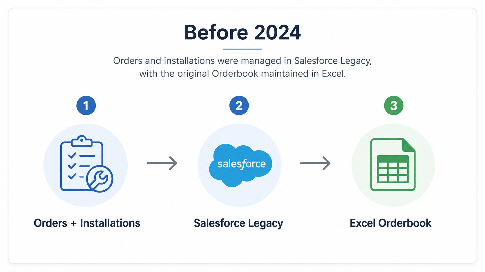
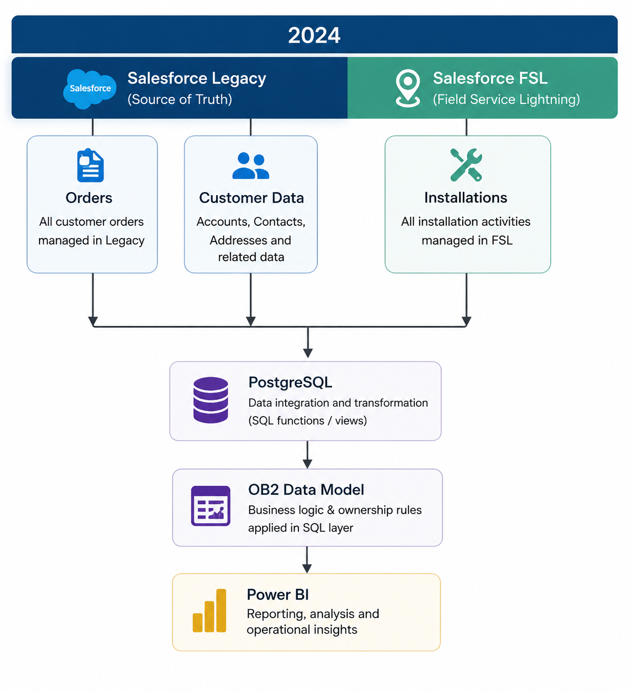
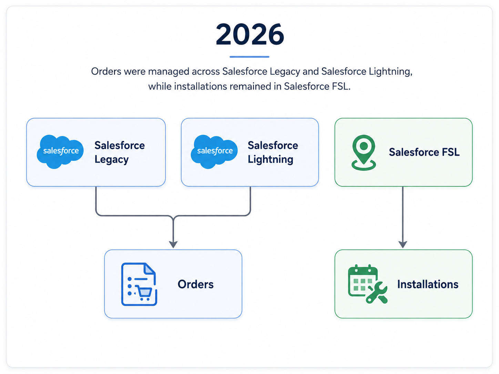
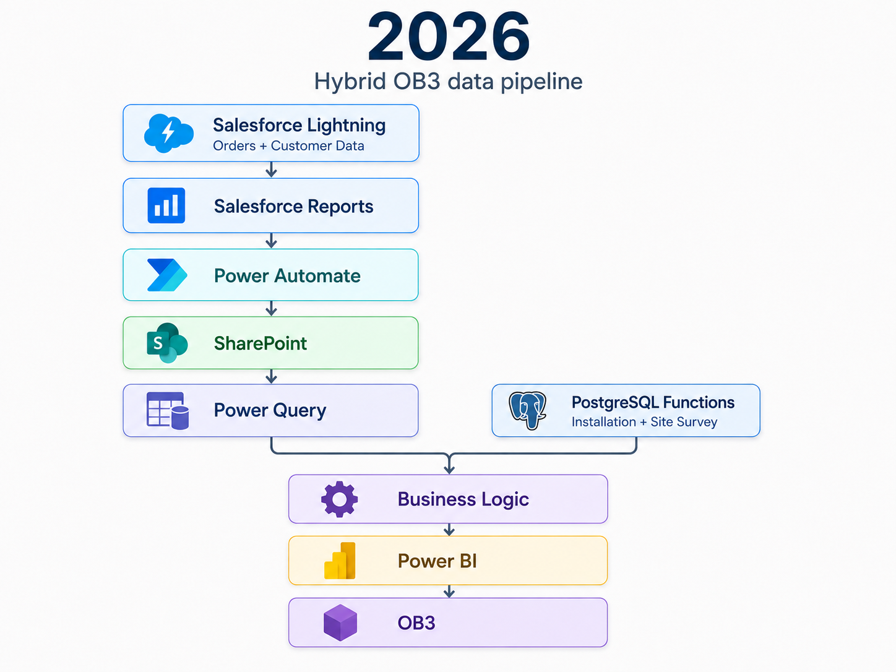
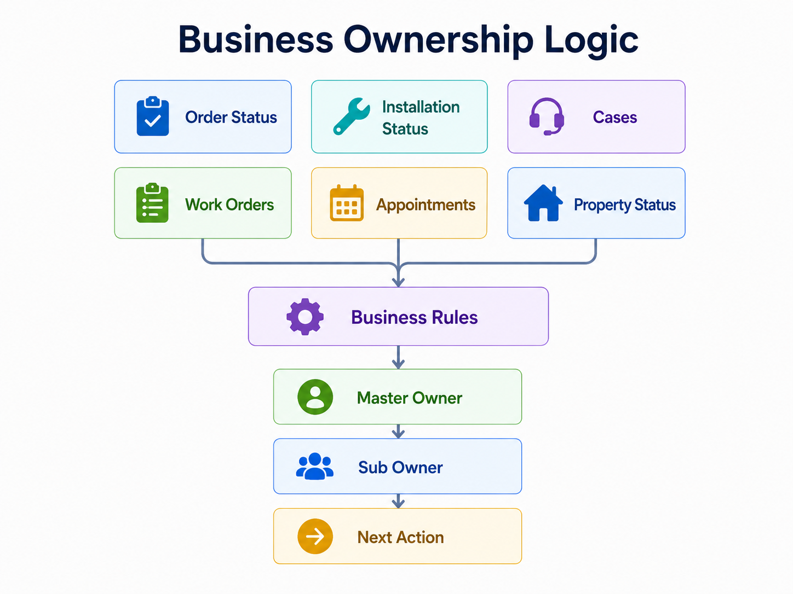
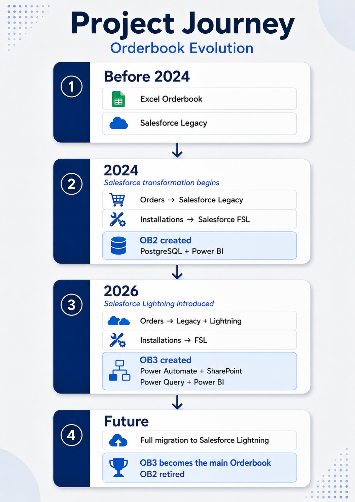

# Order Management Dashboard

## Project Overview

The Orderbook is an operational Power BI solution used to track customer orders from sale through to service activation.

Its main purpose is simple:

> **Show which orders need attention, who owns the next action, and what needs to happen next.**

The solution has evolved as the business grew and moved from Salesforce Legacy to Salesforce Lightning.

---

## The Challenge

The order journey became increasingly complex as systems changed.



The original Orderbook was created in Excel when the customer base was much smaller.

In **2024**, the Salesforce transformation started.

Orders continued to be managed in Salesforce Legacy, but installations moved to the new Salesforce Field Service environment.



This created the need for a more scalable Orderbook capable of combining information from both systems.

---

## OB2 — SQL-Driven Orderbook

I rebuilt the Orderbook using **PostgreSQL and Power BI**.

Multiple SQL functions progressively combine:

- Customer orders
- Installation data
- Work orders
- Cases
- Property information
- Operational exceptions

The final dataset applies custom business logic before being loaded into Power BI.

```text
Multiple Data Sources
        ↓
PostgreSQL
        ↓
SQL Functions
        ↓
Business Logic
        ↓
Final Dataset
        ↓
Power BI
```

This replaced a spreadsheet-based process with a much more scalable reporting solution.

---

## 2026 — A New Challenge

In **2026**, Salesforce Lightning was introduced for order management.

Orders can now exist in either:

- Salesforce Legacy
- Salesforce Lightning

while installations continue to be managed in **Salesforce Field Service**.



This meant OB2 alone could no longer provide the full operational picture.

So I created **OB3**.

---

## OB3 — Power BI-Driven Orderbook

With the Salesforce transformation, the long-term data platform is moving from **PostgreSQL to Snowflake**.

However, not all Salesforce Lightning data was available in Snowflake yet, while the number of new orders in Lightning was increasing quickly.

To avoid waiting for the full data engineering work to be completed, I created an interim solution.

For **orders and customer data**, I used Salesforce Reports exported automatically through Power Automate and stored in SharePoint.

For **installation and site survey data**, I reused the existing PostgreSQL functions originally built for OB2.



This hybrid approach allowed me to deliver OB3 quickly while reusing proven components from OB2.

It also demonstrated that the original OB2 structure was **scalable and reusable**, as the installation and site survey logic could be carried forward into the new solution rather than rebuilt from scratch.

Once the required Salesforce Lightning data is fully available in Snowflake, the SharePoint source can be replaced while keeping most of the reporting and business logic unchanged.


---

# Turning Data Into Action

The most important part of the Orderbook is not the dashboard itself.

It is the **business ownership logic** behind it.

Salesforce may tell us the status of an order, but operational teams need to know:

> **Who needs to act next?**

I created a custom **Master Owner / Sub Owner** model.

### Master Owner

Identifies the department responsible for progressing the order.

### Sub Owner

Identifies the specific scenario and expected next action.

---

## Business Logic


This converts complex operational data into something teams can immediately act on.

A key part of the Orderbook was translating a large number of operational signals into a clear **Sub Owner** and **Next Action**.

The production logic evaluates multiple conditions, including:

- Order and service status
- RFS / RFSi status
- Installation and survey work orders
- Appointment dates and booking status
- Open operational cases
- Activation status
- Contribution and consent requirements
- Duplicate orders
- Network and provisioning issues
- Data-quality exceptions

This allows each order to be automatically classified into the team or action most likely required to progress it.

### Simplified Logic Example

| Scenario | Example Conditions | Classification / Action |
|---|---|---|
| **Pre-Order** | Property not yet ready for service and no installation booked | Pre-Order |
| **RFSi Issue** | Property blocked by RFSi | RFSi With Case / RFSi Without Case |
| **Install Booked** | Active installation work order with a future appointment | Install Booked |
| **Survey Required** | Survey exists but still requires an appointment | Survey Booking Required |
| **Survey Complete** | Survey completed but installation still needs booking | Survey Completed / Booking Awaiting |
| **Consent Required** | Installation on hold with an open Enablement case | Awaiting Consent |
| **Customer Action** | Contribution or customer action required before work can continue | Contribution Required / Customer Action |
| **Installation Exception** | Appointment missed, invalid work-order state or conflicting statuses | Admin Fix - Install |
| **Survey Exception** | Survey appointment or work-order status is inconsistent | Admin Fix - Survey |
| **Activation Pending** | Installation completed but service is not yet active | Awaiting Activation / Assets in Transit |
| **Network Issue** | Completed P2P installation without required network information | Missing Switchport |
| **Duplicate Order** | Multiple active orders detected for the same account | Potential Duplicate |
| **Legacy Active Service** | Service still active in the legacy platform | Live Service in Legacy |
| **Data / System Issue** | Required records, work orders or system information are missing | Admin Fix |

> This is a simplified representation of the production logic. The real solution contains many additional rules and combinations evaluated.

### Example Rule

```sql
CASE
    WHEN rfs_status = 'Blocked by RFSI'
         AND rfsi_case IS NOT NULL
        THEN 'RFSi With Case'

    WHEN survey_status = 'Completed'
         AND installation_date >= CURRENT_DATE
        THEN 'Install Booked'

    WHEN installation_status = 'On Hold'
         AND open_enablement_case = TRUE
        THEN 'Awaiting Consent'

    WHEN installation_date < CURRENT_DATE
         AND service_live = FALSE
        THEN 'Admin Fix - Install'

    ELSE 'Other'
END
```

### Evolution in OB3

The same business-rule framework was reused when the Orderbook was rebuilt in Power BI.

The classification logic was moved into the semantic model using DAX and expanded to use Salesforce Lightning data, including related work orders, service appointments and Get Help cases.

```DAX
Sub Owner =
SWITCH(
    TRUE(),

    [Rank Duplicate Orders] > 1,
    "Potential Duplicate",

    [RFS Status] = "Blocked by RFSI"
        && NOT ISBLANK([RFSi Case]),
    "RFSi with Case",

    [CAD Status] = "On Hold"
        && [Open Enablement Case] = TRUE,
    "Awaiting Consent",

    [CAD Date] >= TODAY(),
    "Install Booked",

    "Unassigned"
)
```
---

# SQL Example

OB2 uses multiple SQL functions to progressively build the final dataset.

```sql
WITH latest_case AS (

    SELECT
        order_id,
        case_type,

        ROW_NUMBER() OVER (
            PARTITION BY order_id
            ORDER BY created_date DESC
        ) AS row_num

    FROM support_cases

    WHERE case_status <> 'Closed'
),

orders AS (

    SELECT
        o.order_id,
        o.customer_id,
        o.order_status,
        i.install_status,
        i.appointment_date,
        c.case_type

    FROM customer_orders o

    LEFT JOIN installations i
        ON o.order_id = i.order_id

    LEFT JOIN latest_case c
        ON o.order_id = c.order_id
       AND c.row_num = 1
)

SELECT
    order_id,
    customer_id,

    CASE
        WHEN install_status = 'Technical Issue'
            THEN 'Technical'

        WHEN appointment_date IS NOT NULL
            THEN 'Scheduled'

        WHEN order_status = 'Pending'
            THEN 'Operations'

        ELSE 'Unassigned'

    END AS owner

FROM orders;
```

### SQL Skills

`CTEs` · `JOINs` · `CASE` · `ROW_NUMBER()` · `PARTITION BY` · `COALESCE` · Window Functions · Data Transformation

---

# Tracking Order Movement

To understand how orders move through the operational process, I created a **daily tracking stored procedure** in PostgreSQL.

The procedure compares the latest recorded Sub Owner for each customer with the current Orderbook classification. A new tracking record is only added when:

- The order is new, or
- The Sub Owner has changed since the last recorded event

This creates a historical event log without storing unnecessary duplicate daily records.

### Simplified SQL Example

```sql
WITH latest_status AS (
    SELECT
        customer_id,
        sub_owner AS previous_sub_owner
    FROM order_tracker
    WHERE event_id IN (
        SELECT MAX(event_id)
        FROM order_tracker
        GROUP BY customer_id
    )
),

current_status AS (
    SELECT
        customer_id,
        service_id,
        sub_owner AS current_sub_owner
    FROM current_orderbook
)

INSERT INTO order_tracker (
    customer_id,
    service_id,
    sub_owner,
    event_date
)

SELECT
    customer_id,
    service_id,
    current_sub_owner,
    CURRENT_DATE

FROM latest_status
FULL OUTER JOIN current_status
USING (customer_id)

WHERE
    previous_sub_owner <> current_sub_owner
    OR previous_sub_owner IS NULL;
```

The procedure also stores a **daily snapshot of the number of orders in each Master Owner and Sub Owner**, allowing historical backlog levels to be recreated for any previous date.

```sql
INSERT INTO daily_order_counts

SELECT
    master_owner,
    sub_owner,
    COUNT(*) AS orders,
    CURRENT_DATE

FROM current_orderbook

GROUP BY
    master_owner,
    sub_owner;
```

This historical tracking allows the report to analyse:

- How orders move between teams and process stages
- How long orders remain within each Sub Owner
- Where orders are getting stuck
- Changes in operational backlog over time
- Process bottlenecks and recurring problem areas
- How ownership volumes change between teams

>The production stored procedure contains additional controls to prevent duplicate daily snapshots and maintain the historical tracking tables.

---

# Power BI Development

OB3 demonstrates a different side of the solution.

Most of the transformation is now performed using:

- **Power Query** for data preparation
- **DAX** for measures and KPIs
- **Power BI** for modelling and reporting
- **Power Automate** for Salesforce extraction
- **SharePoint** as the staging layer

A simplified Power Query ownership rule:

```powerquery
= Table.AddColumn(
    PreviousStep,
    "Owner",
    each
        if [InstallStatus] = "Technical Issue" then "Technical"
        else if [AppointmentDate] <> null then "Scheduled"
        else if [OrderStatus] = "Pending" then "Operations"
        else "Unassigned"
)
```

---

# Business Impact

The Orderbook gives operational teams a clear and consistent way to manage outstanding customer orders.

Instead of manually checking multiple systems and interpreting dozens of fields, users can quickly see:

- **What needs attention**
- **Who owns it**
- **Why they own it**
- **What should happen next**
- **How long the order has been waiting**

This became especially important during the Salesforce transformation, where orders and installations were spread across multiple systems.

---

# Tools Used

| Tool | Purpose |
|---|---|
| **PostgreSQL / SQL** | OB2 transformation and business logic |
| **Power BI** | Reporting, modelling and operational analysis |
| **Power Query** | OB3 transformation |
| **DAX** | Measures and KPIs |
| **Power Automate** | Salesforce Lightning data extraction |
| **SharePoint** | OB3 staging layer |
| **Salesforce** | Orders, customers and installation data |

---

# Skills Demonstrated

**SQL & Data Engineering**  
PostgreSQL · CTEs · JOINs · CASE · Window Functions · Data Transformation

**Power BI**  
Power Query · DAX · Data Modelling · Dashboard Design · Operational Reporting

**Automation**  
Power Automate · Salesforce Extraction · SharePoint Integration

**Business Analysis**  
Process Mapping · Stakeholder Requirements · Business Rules · Ownership Logic · Operational Problem Solving

---

# Project Journey



---

# Screenshots

## Order Management Dashboard


## Owner / Sub Owner Analysis


## Operational Trends


## Order Investigation


## Architecture


---

# Key Takeaway

This project shows how I designed a reporting solution that could evolve with major system changes.

**OB2** demonstrates my SQL and PostgreSQL skills.

**OB3** demonstrates my Power BI, Power Query and automation skills, while also reusing parts of the original OB2 architecture.

The ability to reuse the installation and site survey logic shows that the original solution was designed in a way that was **scalable, modular and adaptable**.

Both are built around the same principle:

> **Transform complex operational data into clear ownership and action.**
